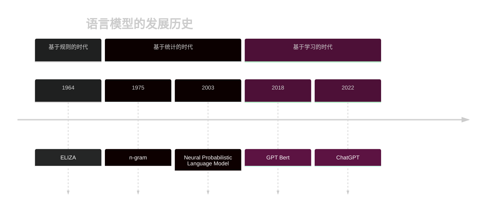
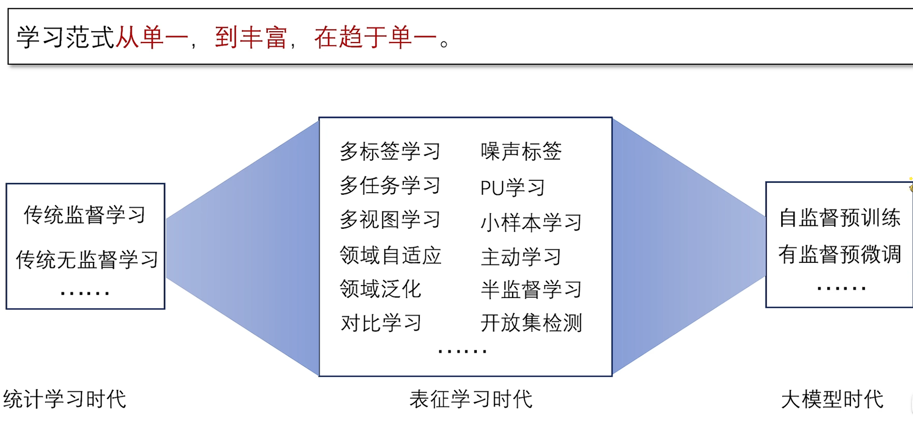

# 语言模型基础与发展历程

## 词元 Token

不可拆分的最小语义单位

原句子：我是谁
词元序列：{我，是，谁}

```mermaid
%%{init: { 'logLevel': 'debug', 'theme': 'dark' } }%%
    timeline
        title 语言模型的发展历史
            section 基于规则的时代
                1964 : ELIZA
            section 基于统计的时代
                1975 : n-gram
                2003 : Neural Probabilistic Language Model
            section 基于学习的时代
                2018 : GPT Bert
                2022 : ChatGPT

```

## 发展历程

当前机器学习的发展主要从基于统计学习时代，到表征学习时代（CNN，需要把输入压缩到一个表征空间），再到大模型时代（端到端，输入prompt即可）。

