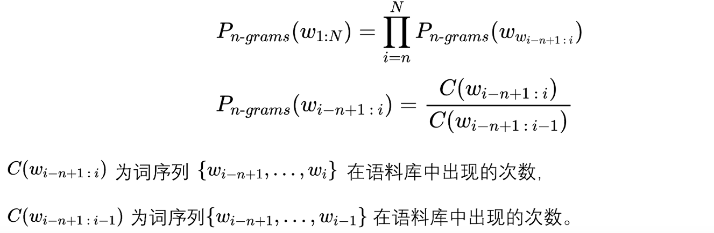
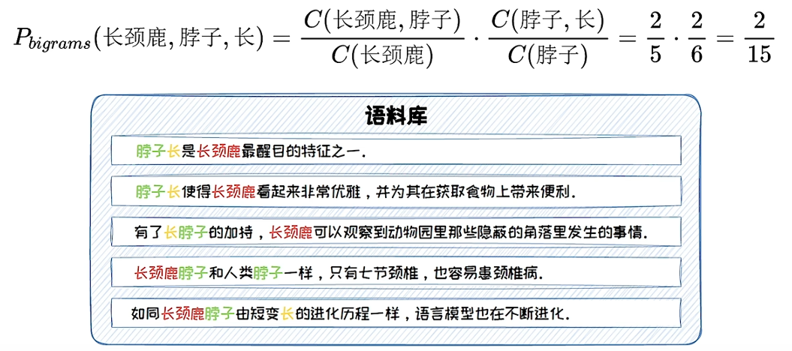
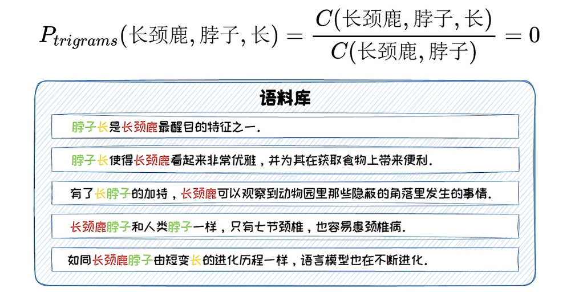
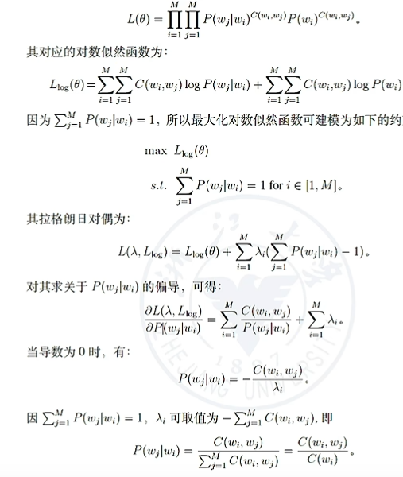
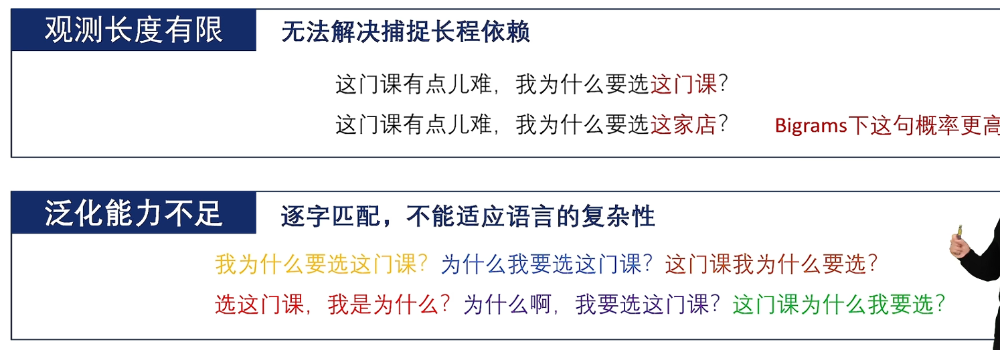

# N-gram

n-gram指的是**长度为n的词序列**。n-grams语言模型通过依次统计文本中的n-gram及其对应的(n-1)-gram在语料库中出现的**相对频率**来计算文本{w1, w2,..., wN}, 记为w1:N出现的概率。

求整个词元序列出现的概率时，就对每一组相对频率P进行连乘。

其中n为变量，当n=1时，称之为unigram，其不考虑文本的上下文关系。n=2时称为bigrams，其对前一个词进行考虑。以此类推n=3时称为trigrams，其对前两个词进行考虑。

C(长颈鹿，脖子)：语料库中出现“长颈鹿脖子”的数量
C(长颈鹿)：语料库中出现“长颈鹿”的数量

C(脖子，长)：语料库中出现“脖子长”的数量
C(脖子)：语料库中出现“脖子”的数量

（语料库中同一句话可能出现多次目标词元）

上图表示在出现“长颈鹿”的文本里，出现“长颈鹿脖子”的概率，和出现“脖子”的文本里“脖子长”的概率，连乘即可得到整句“长颈鹿脖子长”的概率了。虽然“长颈鹿脖子长”没有直接完整出现在语料库中，bigrams模型仍然给出其出现概率为2/15，由此可见，n-grams具备一定**对未知文本的泛化能力**。

## n的选择对n-grams有什么影响

n的选择会影响n-grams模型的**泛化性能**和**计算复杂度**。实际中通常**n<=5**

同样是上述例子，我们计算trigrams：

n=3时，由于语料库中没有出现“长颈鹿脖子长”这一整句话，导致概率为0，也就是零概率现象。

- 当n过大时，语料库中找不到与n-gram一模一样的词序列，就会出现零概率现象，预测不出来，丢失泛化能力。

- 当n过小时，比如一个词时，n-gram未能承载足够的语言信息，不足以反映语料库的特性。

**而随着n增大，n-gram模型的参数呈指数级增长**。假设语料库中包含1000个词汇，unigram的参数量就是1000，bigrams的参数量就是1000*1000.

## n-grams中的统计学原理

n-grams语言模型是在n阶马尔科夫假设下，对语料库中出现的**长度为n的词序列出现概率**的**极大似然估计**。

**翻译翻译：用n-gram里这些词可以最大复原原始语料库的期望。**

## n-grams的缺点

n-gram的观测长度有限（一般小于5）因此无法捕捉长程依赖。此外由于是逐字匹配，语言说法变一变就不准确了，不能适应语言的复杂性。

## n-grams语料及数据

谷歌数字图书馆 The Google Library Project：
https://books.google.com/intl/en-GB/googlebooks/library.html

试图囊括自现代印刷术发明以来的全世界所有书刊，提供unigram到5-gram的数据。

## n-grams的应用

n-gram不仅在输入法、拼写纠错、机器翻译等任务上广泛应用，还推动了文化组学（Culturomics）的诞生，例如流行病预测：大家搜索某个疾病相关症状的概率增高了。