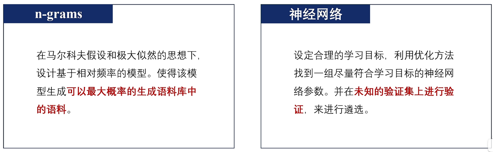
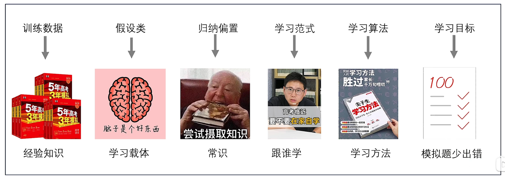
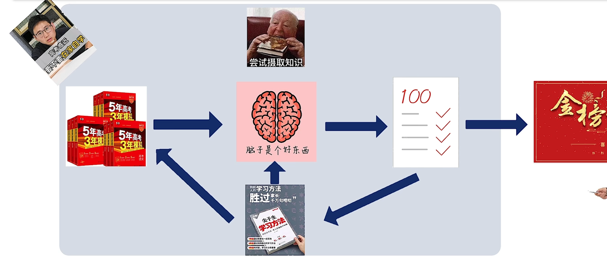
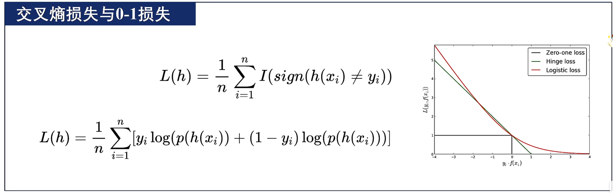
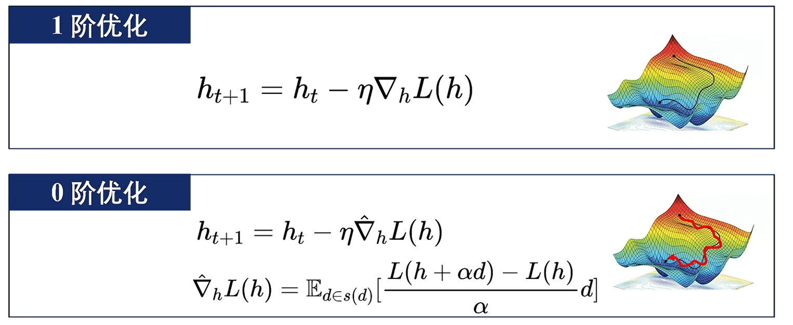

# 基于学习的模型和基于统计的区别

统计：侧重于设计一个模型来**描摹已知**
学习：侧重于找到一个模型**利用已知来预测未知**

## 机器学习的过程

在某种**学习范式**下，基于**训练数据**，利用**学习算法**，从受**归纳偏置**限制的**假设类**中选取出可以达到**学习目标**的假设，该假设可以**泛化**到未知数据上。

将学习目标设定为语言模型所需的目标，学习到的假设就可以**端到端**的生成语言序列的概率。

## 训练数据

训练数据（Training Data，记为S）是**可用于训练模型的数据**。训练数据的**数量和质量（多样性、噪声等）都会影响机器学习的性能**。对于语言模型，训练数据可以选择公开的语料数据。

## 假设类

假设类（Hypothesis Class，记为H）是指**所有可能机器学习模型的集合**，其中元素为假设（Hypothesis）实践中通常指定**候选模型的参数空间**为假设类（例如SVM使用的假设类半空间、神经网络里面的RNN，Transformer等）。当前**大语言模型主要选用神经网络作为假设空间**。

## 归纳偏置

归纳偏置（Inductive Bias）**限制对某些假设进行选择**。对于语言模型而言，常用的归纳偏置是上下文间存在的关联。

例如传统SVM的归纳偏置是最大化训练样本到超平面的距离以让两类分的尽量开，神经网络里的归纳偏置有CNN的局部感受野、RNN的时间序列、Transformer的稀疏注意力等。

## 学习范式

广义的学习范式包括监督学习、无监督学习、强化学习。大语言模型通常采用自监督学习范式（基于自动构建的标签进行的监督学习）。

- 监督学习：给定样本及其标签完成分类、回归任务。
- 无监督学习：无标签的自组织学习
- 强化学习：从探索中学习，通过尝试和错误来学习行为策略，优化策略以达到最大化累计奖励的目标。

## 学习目标

不同学习范式有不同的学习目标，例如**经验风险最小化**（Empirical Risk Minimization），旨在最小化模型在训练集上的错误；或者**相对距离最小化**，用于聚类分类的算法比如K-Means上。

## 损失函数

损失函数（Loss Function）用以**衡量模型在对应样本上的错误程度**。大多数损失函数是错误程度的代理损失（Surrogate Loss）。损失函数在训练集上的结果的加权和称为训练损失（Training Loss）。

例如在二分类问题上，用一个连续函数来模拟0-1损失，因为的0-1损失可能是离散的，可能是间断的、无法求导的，因此很多时候无法直接对其进行优化。

## 学习算法

学习算法旨在对损失进行优化。其背后的理论基础为最优化理论。

一阶优化就是梯度下降法中的最速下降法，零阶优化通常用于x和f(x)间是黑盒的状况，通过类似导数定义添加一个微小的扰动，算出一个估计的梯度。

## 泛化误差

机器学习的目的在于减小**泛化误差**（Generalization Error），即真实误差（True Error）（比方说高考前练习得再好，也需要在真实考场上答对未知题目）

