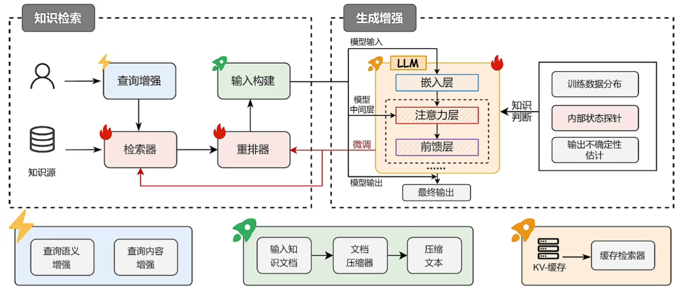

## RAG简介

### 幻觉现象

幻觉现象可能直接来源于训练数据中的**知识错误**，也可能源于模型本身**对知识掌握的不足**。

比如：
- **知识过时**：由于训练数据中的**时间滞后**，其中的知识可能在模型训练后又发生了更新，导致模型内部知识的过时。（比如deepseek最新知识大概到2023年）
- **知识边界**：由于训练数据的**有效性**，无法覆盖所有范围，且知识在训练数据采集完成后仍会**不断新增**。（有些具体专业的知识模型不知道）
- **知识偏差**：训练数据中可能包含**不实与偏见信息**
- **对齐不当**：人为偏好导致**数据标注不当**引入不良偏好
- **知识长尾**：训练数据中部分信息都出现**频率较低**，导致模型对这些知识的**学习程度低**（没学明白）
- **曝光偏差**：由于模型***训练与推理**任务存在**差异**，导致模型在实际推理时**存在偏差**（比如模型训练过程中没有采用Teacher Forcing会导致错误累积）
- **解码偏差**：模型解码策略中的**随机性**可能影响输出的准确性（解码生成的文字根据权重有一定随机性）

## 用RAG防止幻觉

当我们遇到无法回答的问题时，借助**搜索引擎**或**查阅书籍资料**来解决问题。通过**检索**与问题相关的信息进行辅助，从而****有效缓解幻觉现象**，大幅提高模型的生成质量。

## RAG概念与组成

RAG（Retrieval-Augmented Generation）检索增强生成，是一种从外部数据库中**检索相关信息**来辅助**改善大模型生成质量**的系统。一个基本的RAG框架主要包含**知识检索**和**生成增强**两大模块。

- **知识检索**：对输入问题进行编码，从大规模的知识库（如维基百科）中**高校检索**出与问题相关的文档。常用的检索算法包括基于关键词匹配的**稀疏检索算法**与基于神经网络的**稠密检索算法**
- **生成增强**：利用检索文档和输入问题，生成最终的输出序列，一般采用**预训练语言模型**如Llama等。生成器利用外部知识的最常见的方式便是通过Prompt形式。

