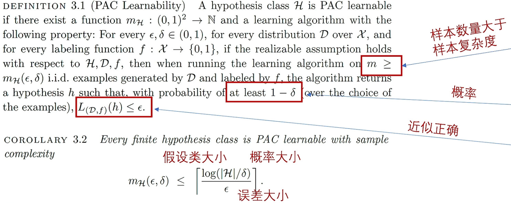
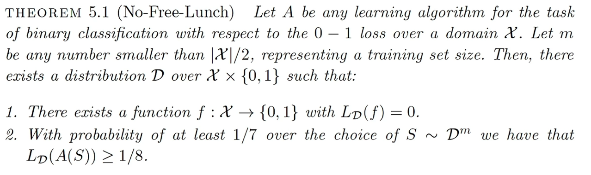

# PAC理论

概率近似正确（Probably Approximately Correct）为机器学习提供了**对机器学习方法进行定量分析的理论框架**，可以为设计机器学习方法提供理论指导。

提出者Leslie Valiant获得2010年图灵奖。

PAC理论的思想在于：当**样本数量**符合一定条件时，机器学习模型可以以一定**概率**达到**近似正确**。（说是近似正确是因为无论多强的模型对真实情况的100%完美预测都是不可能的，L不可能为0）

## 没有免费午餐

没有免费午餐（No-Free-Lunch Theorem）指出：**没有放之四海而皆优的机器学习方法**。总存在场景，让一个机器学习方法表现不佳。

