## 如何将上下文输入给语言模型

将上下文输入进语言模型时，可以是“一个字接一个字”的**串行输入**，也可以是“一股脑”的**并行输入**。

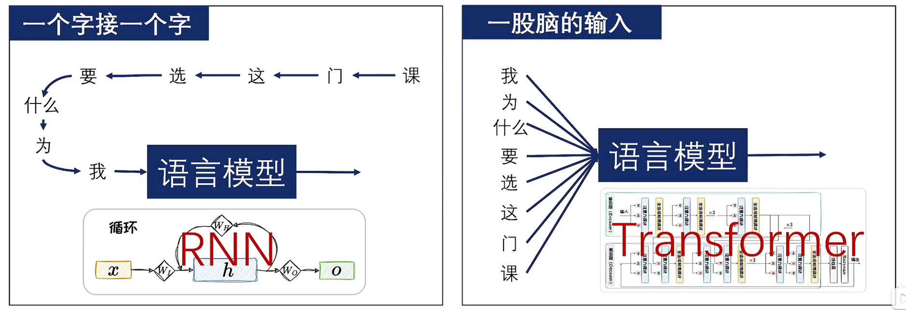

## RNN

典型的串行输入的语言模型是循环神经网络（Recurrent Neural Network，RNN），其是一类**网络中包含环路**的神经网络的总称。

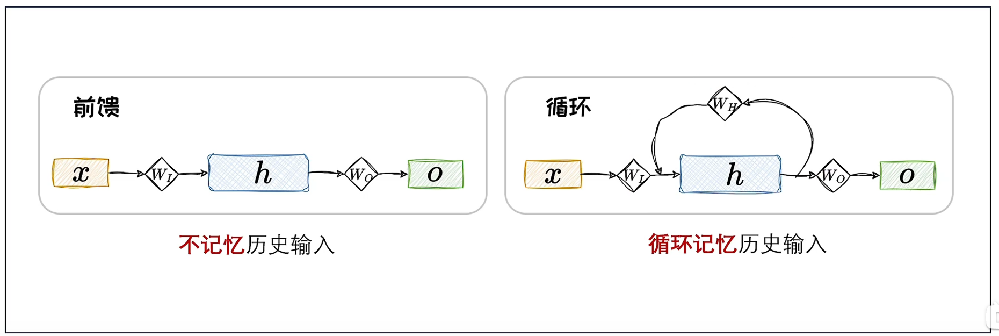

传统前馈神经网络对历史是没有感知的，RNN在串行输入的过程中，前面的元素会被循环编码成**隐状态**，并**叠加到当前的输入上面**。其在t时刻的输出如下：

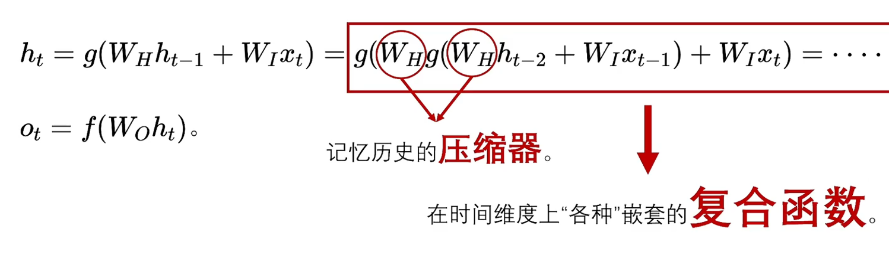

每一个函数输入里包含上一个输入通过同一个函数编码的结果，因此形成嵌套。RNN可以将历史状态以隐变量的形式循环叠加到当前状态上，对历史信息的考虑，呈现出**螺旋式前进**的模式：

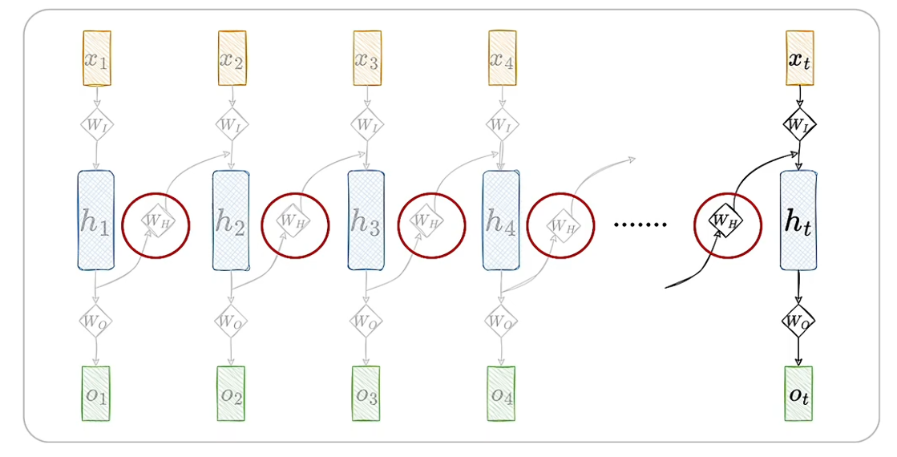

### 梯度爆炸

在训练RNN时，涉及大量的矩阵联乘操作，容易引发**梯度衰减**或**梯度爆炸**问题。

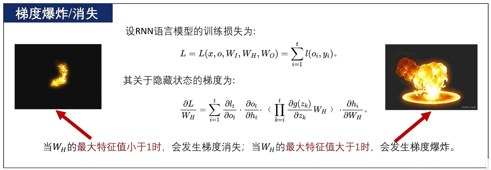

## LSTM

为解决经典RNN的梯度衰减/爆炸问题，带有**门控机制**的LSTM被提出。

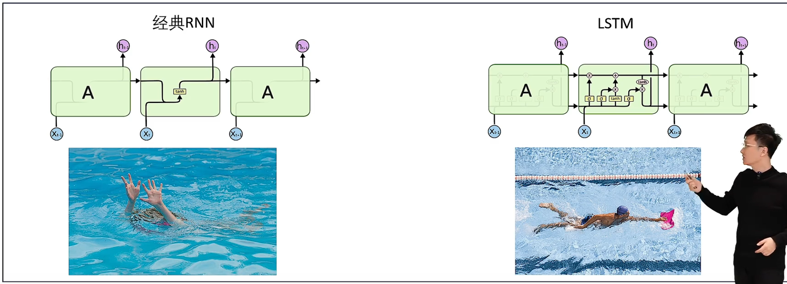

通过控制门控制历史输入来进行**累加**，而不是联乘。

LSTM将经典RNN中的通过复合函数传递隐藏状态的方式，解耦为**状态累加**。隐藏状态通过**遗忘门**、**输入门**来实现合理的状态累加，同过输出门实现合理整合。

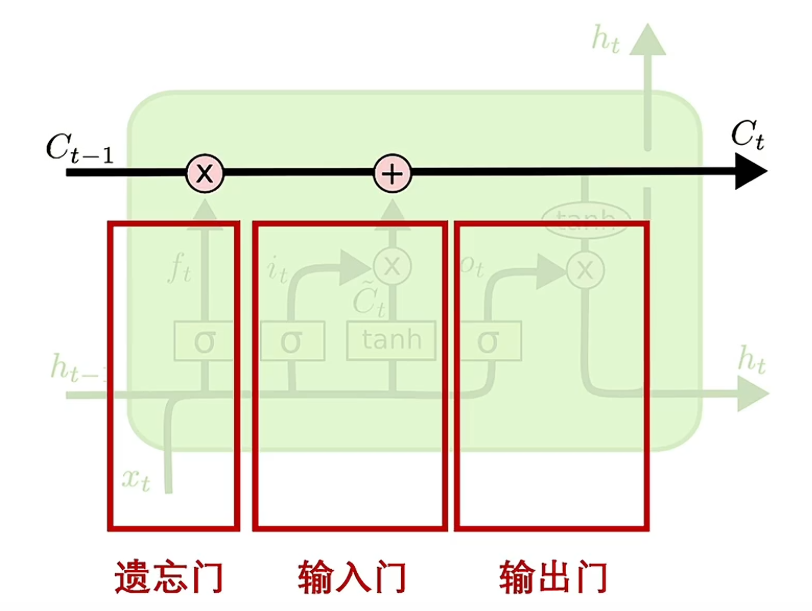

**遗忘门**用来适度**忘记“往事”**：

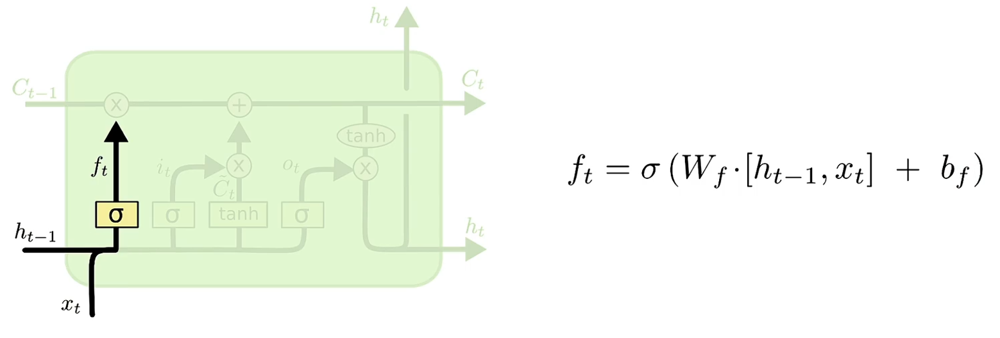

**输入门**用来对“新闻”进行**选择性聆听**：

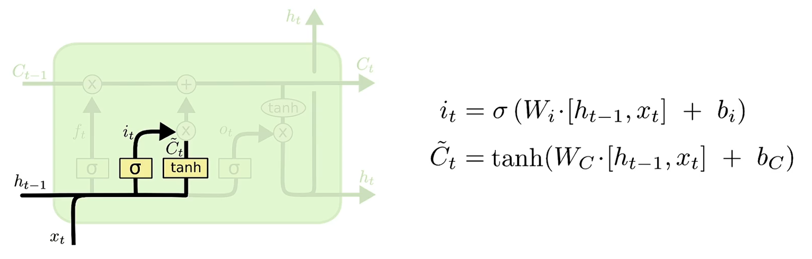

将**往事与新闻相加**得到当前状态：

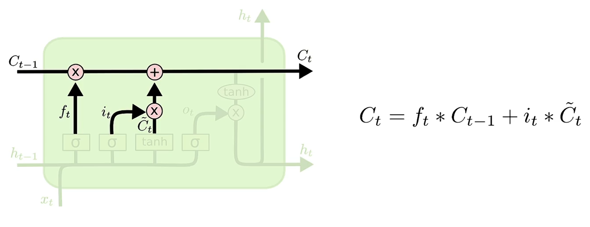

最后用输出门将当前状态**适度**输出：

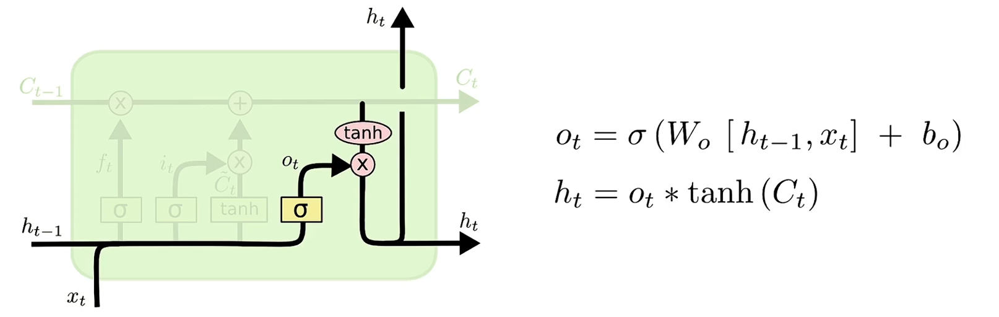

## GRU

为**降低LSTM的计算成本**，GRU将遗忘门与输入门进行合并。

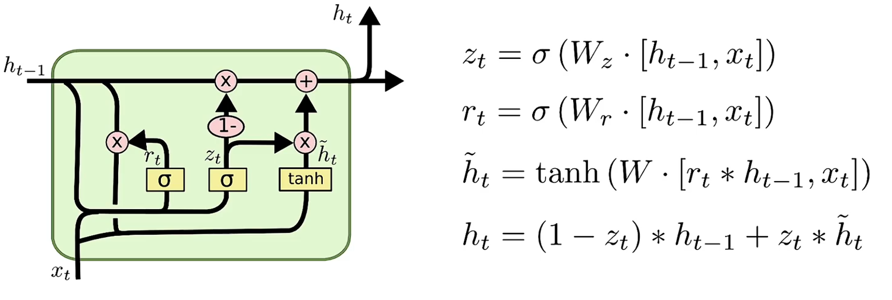