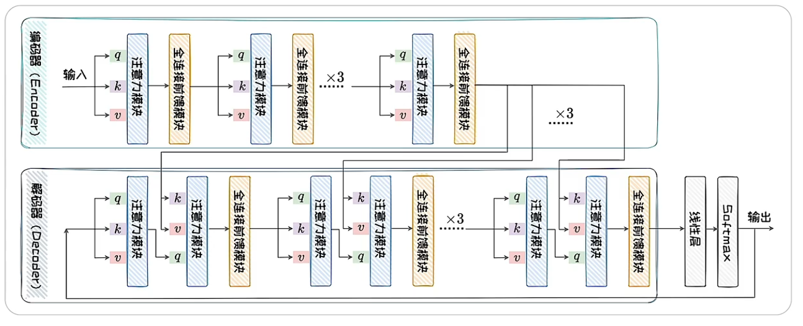
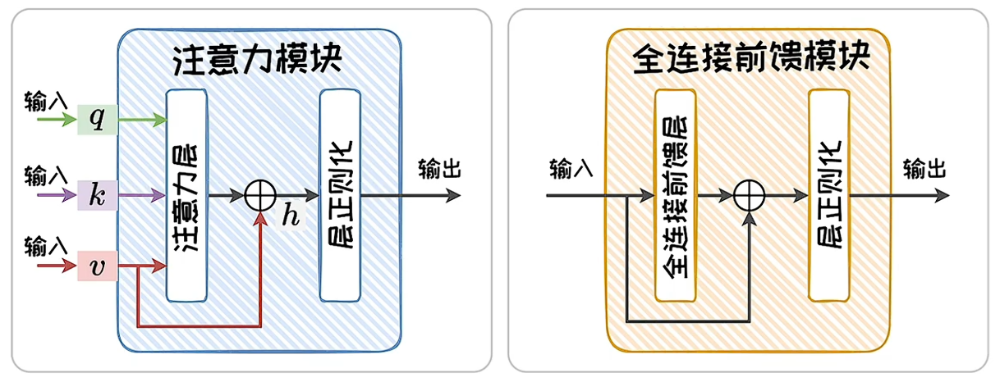
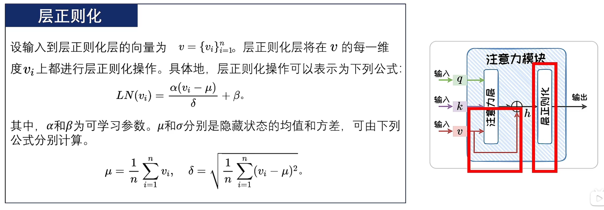
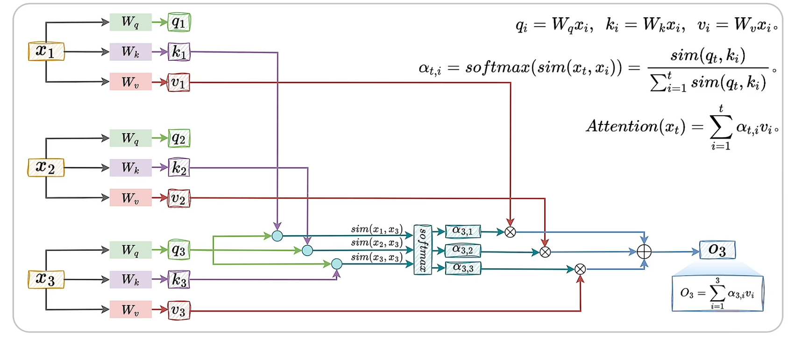
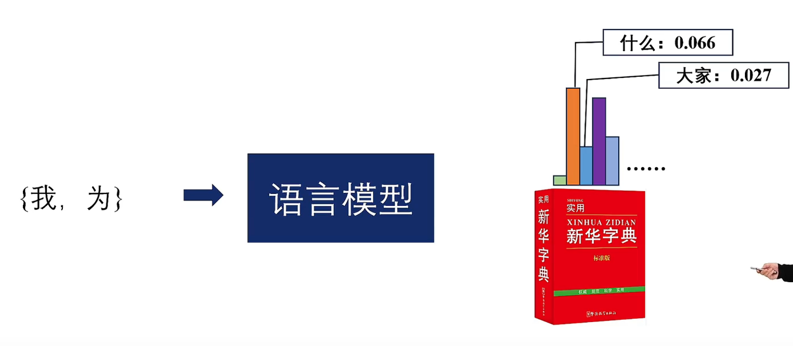

# Transformer

典型支持**并行输入**的模型是Transformer，是一类基于**注意力机制（Attention）的模块化构建的神经网络结构**。



Transformer中两种主要模块为（1）注意力模块；（2）全连接前馈模块。

- **注意力模块**：负责对**上下文**进行通盘考虑。
- **全连接前馈模块**：占据Transformer近三分之二的参数，掌管着Transformer模型的**记忆**。



## 层正则化与残差连接

**层正则化（Layer Normalization）** 是一种特征缩放技术，主要用于修改神经网络中层的输入数据。用来规范化每个特征，确保每层的输入分布保持一致。这有助于**加速训练过程**并取得更好的**泛化性能**。引入**残差连接**可以有效解决梯度消失问题。



代码示例

以下是一个简单的层正则化实现示例：

```python
import torch
import torch.nn as nn

class LayerNorm(nn.Module):
def __init__(self, features, eps=1e-6):
super(LayerNorm, self).__init__()
self.gamma = nn.Parameter(torch.ones(features))
self.beta = nn.Parameter(torch.zeros(features))
self.eps = eps

def forward(self, x):
mean = x.mean(-1, keepdim=True)
std = x.std(-1, keepdim=True)
return self.gamma * (x - mean) / (std + self.eps) + self.beta

# 使用示例
x = torch.randn(10, 5)
layer_norm = LayerNorm(5)
output = layer_norm(x)
print(output)
```


## 注意力层

注意力层采用**加权平均**的思想将前文信息叠加到当前状态上。



## 语言模型的输出

通常语言模型在一次预测中，输出的是一个**概率向量**。其中每一维代表了词表中**对应词出现的概率**。



## 基于RNN和Transformer的语言模型

以预测下一个词出现的概率为目标，解释基于RNN和Transformer的语言模型的训练流程及推理过程。