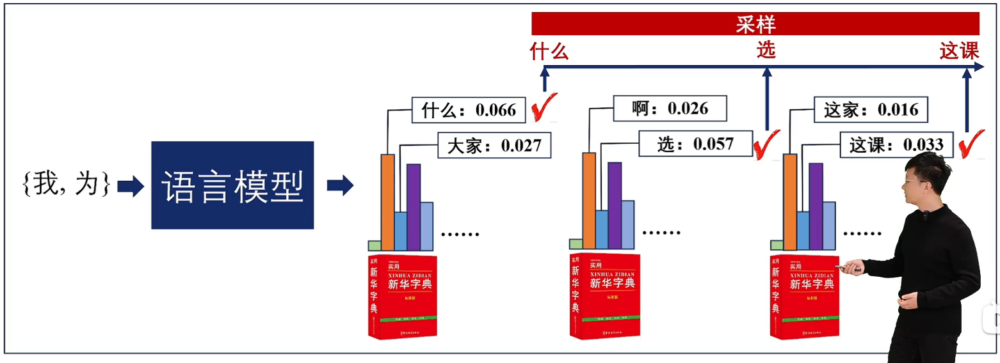
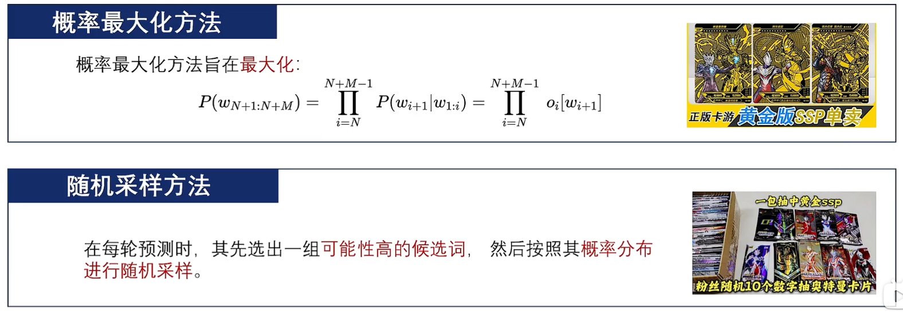
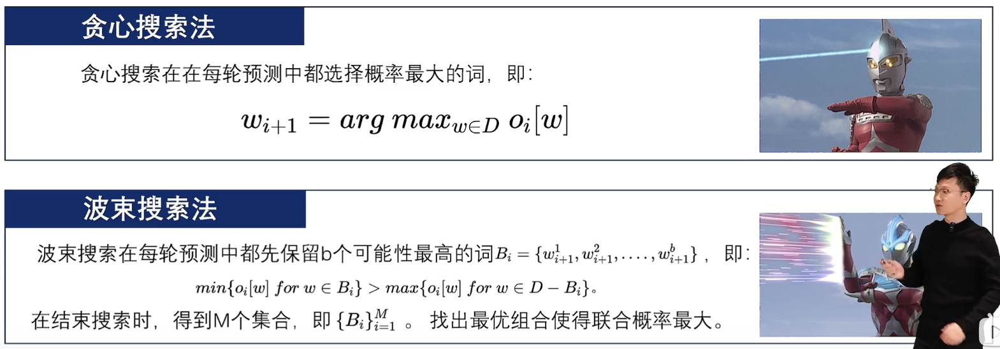
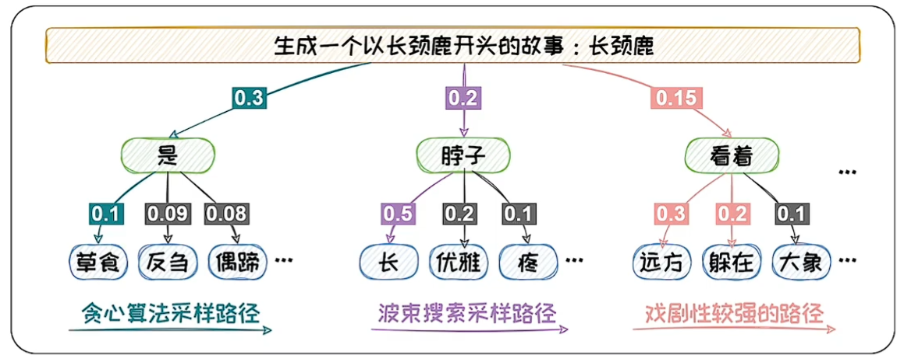
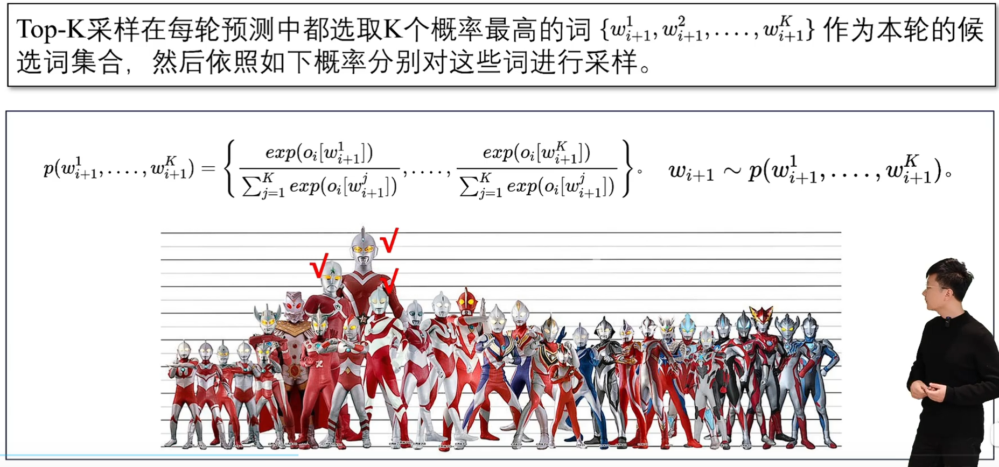

## 语言模型的采样

语言模型每轮预测输出的是一个概率向量。我们需要**根据概率值从词表中选出本轮输出的词元**，选择词元的过程被称为**采样**。

两类主流的采样方法可以总结为（1）**概率最大化方法**；（2）**随机采样方法**

概率最大化方法：类似贪心算法，取每一个概率最大的词以达到整体联合的概率最大化。

随机采样方法：在可能性高的一组里随机选择一个。

## 概率最大化方法

假设生成M个词元，概率最大化方法的搜索空间为M^D，是**NP-Hard**问题。

贪心搜索只顾“眼前利益”，忽略了“远期利益”。当前概率大的词有可能导致后续的词概率都很小。**贪心搜索容易陷入局部最优**，难以达到全局最优解。

贪心：每轮直接找概率最高的。
波束：每轮选可能性最高的b个词，一轮又一轮最后找里面联合概率最高（连乘最大值）的路径。
戏剧性强：概率约束不强的选择方式。

波束搜索在每轮预测中考虑了更多的可能性，从而可以**在一定程度上减少陷入局部最优**。达到全局最优的可能性更高。

## 随机采样的方法

什么时候选戏剧性强的路径？

概率最大的文本通常是生成**最为常见的文本**。这些文本会略显平庸。在开放式文本生成中，贪心搜索和波束搜索都容易生成一些“**废话文学**”--重复且平庸的文本。

为了增加生成文本的多样性，**随机采样的方法**在预测时**增加了随机性**。在每轮预测时，其先选出**一组**可能性高的候选词，然后按照其概率分布进行随机采样。

## Top-k采样方法

Top-k采样每次选前K个概率最高的词作为本轮的候选词集合。

