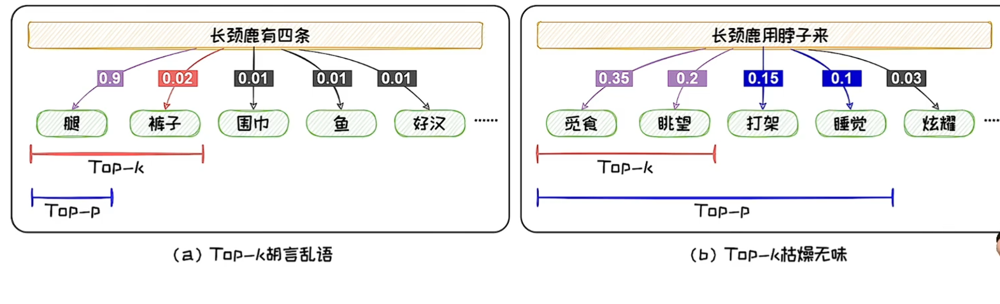

## 语言模型的采样

语言模型每轮预测输出的是一个概率向量。我们需要**根据概率值从词表中选出本轮输出的词元**，选择词元的过程被称为**采样**。

两类主流的采样方法可以总结为（1）**概率最大化方法**；（2）**随机采样方法**

概率最大化方法：类似贪心算法，取每一个概率最大的词以达到整体联合的概率最大化。

随机采样方法：在可能性高的一组里随机选择一个。

## 概率最大化方法

假设生成M个词元，概率最大化方法的搜索空间为M^D，是**NP-Hard**问题。

贪心搜索只顾“眼前利益”，忽略了“远期利益”。当前概率大的词有可能导致后续的词概率都很小。**贪心搜索容易陷入局部最优**，难以达到全局最优解。

贪心：每轮直接找概率最高的。
波束：每轮选可能性最高的b个词，一轮又一轮最后找里面联合概率最高（连乘最大值）的路径。
戏剧性强：概率约束不强的选择方式。

波束搜索在每轮预测中考虑了更多的可能性，从而可以**在一定程度上减少陷入局部最优**。达到全局最优的可能性更高。

## 随机采样的方法

什么时候选戏剧性强的路径？

概率最大的文本通常是生成**最为常见的文本**。这些文本会略显平庸。在开放式文本生成中，贪心搜索和波束搜索都容易生成一些“**废话文学**”--重复且平庸的文本。

为了增加生成文本的多样性，**随机采样的方法**在预测时**增加了随机性**。在每轮预测时，其先选出**一组**可能性高的候选词，然后按照其概率分布进行随机采样。

## Top-K采样方法

Top-k采样每次**选择前`k`个概率最高的词作为本轮的候选词集合**，从中进行随机采样。`k`一般取1-40。

## Top-K采样的问题

当候选词的分布的**方差较大**的时候，可能会导致本轮预测选到概率较小、不符合常理的词，从而产生“**胡言乱语**”。而当候选词的分布的**方差较小**的时候，固定尺寸的候选集无法容纳更多的具有相近概率的词，导致**候选集不够丰富**。

由于这里k固定取前概率最大的2个，导致图1中不太可能是正确选项的“裤子”也被选进来了，然而其概率与“腿”的概率相差很大。

而在图2中各个词的概率相差不大，其实都可以选，但是由于k只能选两个，于是只有“觅食”和“眺望”入选。

## Top-P采样方法

Top-P设定一个**概率阈值**，高于阈值的都可以加入候选集。一般做法是设定一个值`p`，然后**选择一组词使得它们的总和概率刚好大于等于`p`**，再在其中随机采样。`p`一般取0.95。

## Top-P的优势

应用阈值作为候选集选取的标准之后，Top-P采样可以**避免选到概率较小、不符合常理的词，从而减少“胡言乱语”**。其还可以**容纳更多的具有相近概率**的词，增加文本的丰富程度，**改善“枯燥无味”**。

## Temperature机制

Top-K采样和Top-P采样的随机性由语言模型的输出的概率决定，不可自由调整。但在**不同场景**中，我们**对于随机性的要求可能会不同**。引入Temperature机制可以对解码随机性进行调节。

| 参数 | 控制原理 | 对Output产生的效果 | 何时使用 |
| --------------  | -------------------------- | --------------------- | ------------------- |
| **Temperature** | 在softmax归一化前 对网络最后一层的生成结果进行缩放 | 在选择token前 对整体的随机性进行调整 | 在不限定选择哪些词的情况下 调整输出的创造性 |
| **Top-k**       | 选择前`k`个token作为随机采样的集合 | 将选择严格限制在概率最高的`k`个token中 | 避免选到罕见或者完全无关的词 |
| **Top-p**       | 选择累计总概率为`p`的token作为随机采样的集合 | 根据置信度调整样本空间的大小 | 动态控制多样性 |

## 语言模型的评测

得到一个语言模型后，我们需要对其生成能力进行评测，以判断优劣。评测语言模型生成能力的方法可以分为两类：（1）**内在评测**，（2）**外在评测**

### 内在评测

最为常用的内部评测指标是**困惑度**（Perplexity）其度量了语言模型对测试文本感到“困惑”的程度。设测试文本为Stest = W1:N。语言模型在测试文本上的困惑度可由下式计算：

### 基于统计指标的评测

BLEU（BiLingual Evaluation Understudy）是应用最为广泛的统计指标之一。其最早被提出用于评价模型在机器翻译（Machine Translation，MT）任务上的效果。BLEU计算了**多层次n-gram匹配精度的几何平均**。

n=1时，三个词里有两个对的上，所以是2/3，n=2时，两个词组成的large language和language model中language model生成的翻译和参考文本对的上，所以是1/2。

### 基于上下文嵌入的评测

典型的基于上下文词嵌入的评测方法是BERTScore。BertScore从**精度**（Precision）、**召回**（Recall）和**F1**量度三个方面对生成文档进行评测。其定义分别如下：

### 基于生成模型的评测

G-EVAL利用GPT-在**没有参考文本**的情况下对生成文本进行评分。通过**提示词工程**（Prompt Engineering）引导GPT-4输出评测分数。

（直接用另一个大模型来当裁判，prompt里写一下评判标准就行）

## 语言模型的应用

语言模型的**输出值**以及**中间结果**可以直接或间接地解决各类自然语言处理任务。

